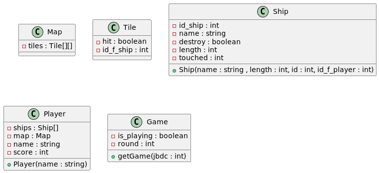

# Bataille Navale


Welcome to the GitHub repository for our Bataille Navale game, a Java implementation of the classic Battleship game using Swing for graphical user interface components. This project is designed to showcase advanced concepts of Object-Oriented Programming (OOP) such as polymorphism, encapsulation, and introspection, along with robust error handling.

## Authors

- [@tteuru09](https://github.com/tteuru09)
- [@naikibro](https://github.com/naikibro)

## Table of Contents

- [Prerequisites](#1---prerequisites)
- [Installation](#2---installation)
- [Running the Game](#3---running-the-game)
- [Key Concepts](#4---key-concepts)
- [Documentation](#5---documentation)
- [Project Management](#6---project-management)
- [License](#7---license)

---

## 1 - Prerequisites

To run this project, you'll need:

- Java Development Kit (JDK) 17
- An IDE such as IntelliJ IDEA or Eclipse

## 2 - Installation

1. Clone the repository:
   ```bash
   git clone https://github.com/naikibro/BatailleNavale.git
   ```
2. Open the project in IntelliJ IDEA or Eclipse:
   - **IntelliJ:** Open -> Select the cloned directory -> Open as Project
   - **Eclipse:** File -> Open Projects from File System... -> Directory...

## 3 - Running the Game

To run the game, navigate to the `src` directory in your IDE and run the main class. Make sure that your environment is configured to use JDK 17.

## 4 - Key Concepts

This project illustrates several key OOP concepts:

- ~~**[Introspection:](gui/src/common/Scoreboard.java)** Utilizing Java's reflection capabilities to dynamically inspect classes.~~ SUNSETTED
- **[Polymorphism:](gui/src/ship/BattleShip.java)** Using superclass references to operate on objects of various subclasses.
- **[Encapsulation:](gui/src/ship/Ship.java)** Restricting direct access to some of the object's components.
- **[Error Handling:](gui/src/common/MapComponent.java)** Implementing comprehensive error handling throughout the game to manage runtime exceptions effectively.
- **[GUI Development:](gui/src/pages/LandingPage.java)** Employing Java Swing to create interactive and visually appealing user interfaces.
- **[Serialization:](gui/src/fleet/Fleet.java)** Creating binary representations of actual Java objects
- **[Events:](gui/src/common/MapComponent.java)** trigger methods on events

### The words of the authors

**Naiki**

State pattern
- We could have used state pattern for Tiles
- But i think it is costly to implement at the start of the project
- It would have been nice to have but not absolutely necessary on a small scale project like this*

The choice of Swing
- Swing is not thread safe
- This stack choice limits the evolution of our project
- This game cannot ( without high costs ) transition to a thread-intensive game

The global folder architecture
- we could have gone with a more well-defined folder structure
- we tried to separate the logic from the display
- assets are in dedicated folder
- I think we should have used folder like (model, pages, components, data, assets ) to separate responsabilities

***
## 5 - Documentation
You can access the documentation inside the [docs](Docs/MLD.plantuml) folder  
Don't hesitate to contribute by raising any issues or completing documentationb


## 6 - Project Management

You can track our project management activities and progress on GitHub Projects:
[Project Management Link](https://github.com/users/naikibro/projects/4/views/1)

## 7 - License

This project is open-sourced under the MIT license. See the `LICENSE` file for more details.

---

Thank you for checking out our Bataille Navale game. We hope you enjoy playing it as much as we enjoyed making it!

```
______       _        _ _ _                               _      
| ___ \     | |      (_) | |                             | |     
| |_/ / __ _| |_ __ _ _| | | ___   _ __   __ ___   ____ _| | ___ 
| ___ \/ _` | __/ _` | | | |/ _ \ | '_ \ / _` \ \ / / _` | |/ _ \
| |_/ / (_| | || (_| | | | |  __/ | | | | (_| |\ V / (_| | |  __/
\____/ \__,_|\__\__,_|_|_|_|\___| |_| |_|\__,_| \_/ \__,_|_|\___|
```